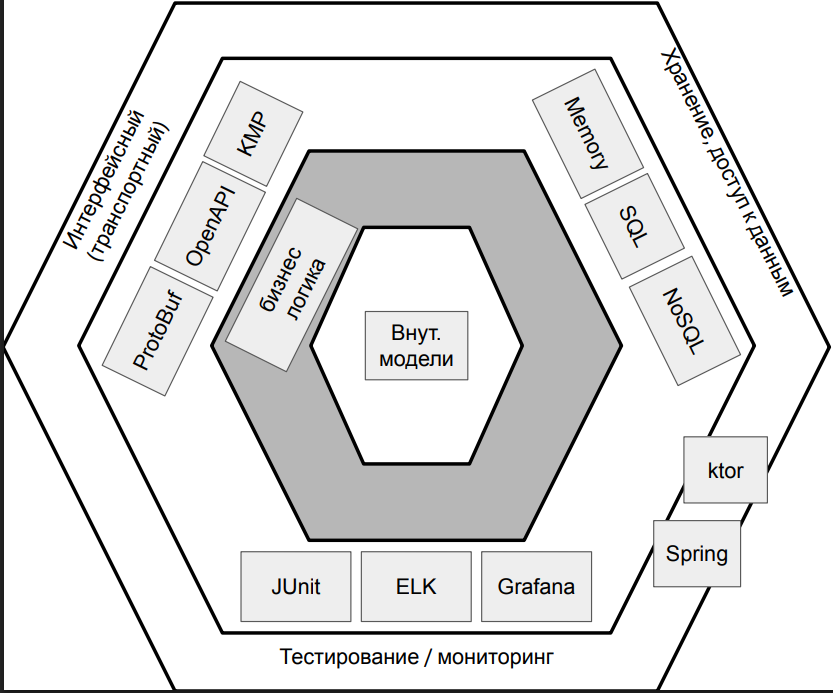
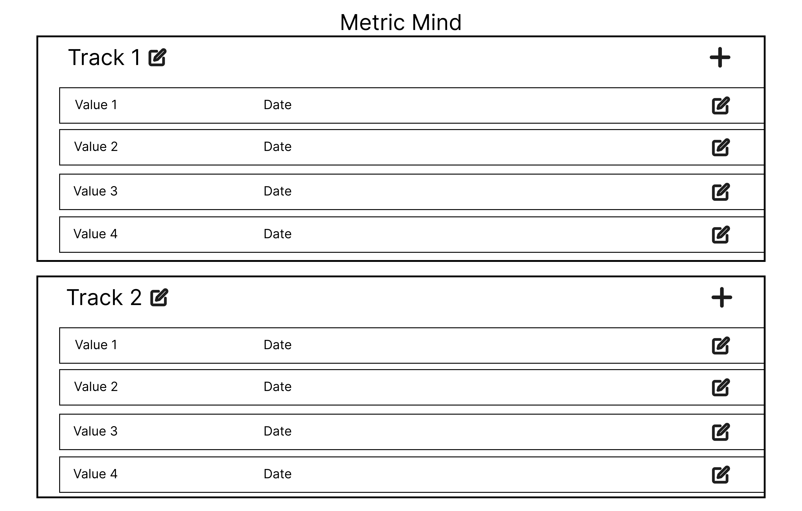

# MetricMind: Трекер Значений

Приложение позволяет вносить данные и отслеживать их изменение(трек). В качестве вносимых данных может быть:

- собственный вес, мышечная и костная масса, объемых разных частей тела и т.д.;
- количество подходов в физических упражнениях, используемые веса, длительность упражнения и др.;
- отслеживание КБЖУ;
- отслеживание полезных/вредных привычек;
- фиксация счета в настольных играх;
- и т.д.

## Задачи проекта:

- упростить и сделать более гибким отслеживание какиех-либо данных или показателей;
- сделать отслеживание более "умным" за счет группировки треков, так как многие показатели могут зависеть от других
  показателей;
- помочь людям достигать своих целей за счет открытости треков для сторонних наблюдателей и за счет этого формирования
  партнерства.

## MVP

### Серверная часть

- [ ] добавление треков
- [ ] редактирование треков
- [ ] удаление треков
- [ ] добавления значений в трек
- [ ] редактирование значений в треке
- [ ] удаление значений из трека

### Клиентская часть

- [ ] отображение списка треков и их значений
- [ ] добавление трека
- [ ] редактирование трека
- [ ] удаление трека
- [ ] добавления значеня в трек
- [ ] редактирование значеня в треке
- [ ] удаление значеня из трека

## Целевые платформы:

- web
- android
- ios

## Архитектура бэкенда

## Визуальная схема фронтенда

# Структура проекта

1. [metric-mind-be](metric-mind-be) - бэкенд приложения
2. [metric-mind-client](metric-mind-client) - мультиплатформенный клиент